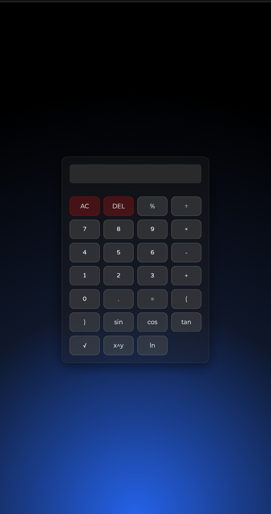
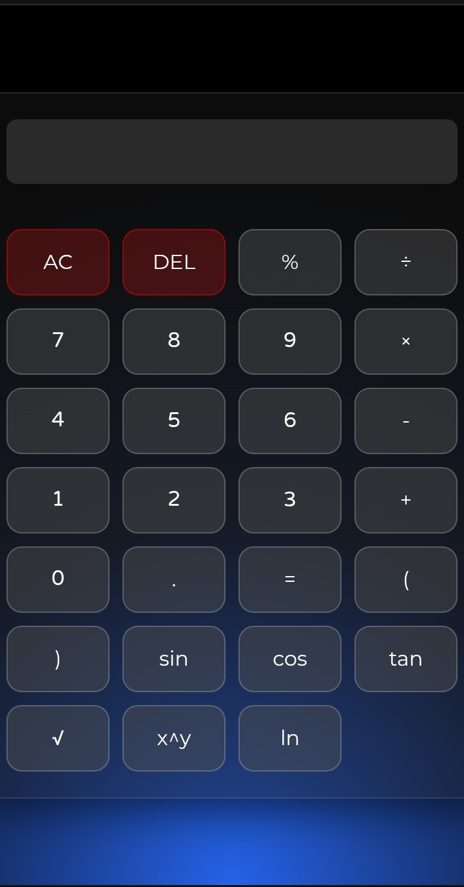

# ➗ Calculator ✖️
It is a Calculator, consisting of **multiplication, addition, subtraction, division and some scientific features**.

# 💻 Desktop Demo

# 📱 Mobile Demo

# ❌ Errors

- There are no errors:)

# 🌟 What's Special?

- It has a good UI 
  
- Scientific features

- Only made with 30-60 lines of code
  
# 🔴 Live Preview
# https://html-guy0.github.io/Calculator/
